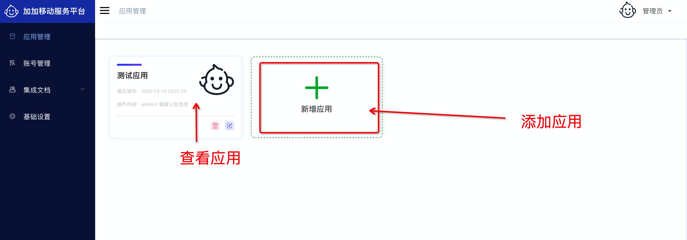
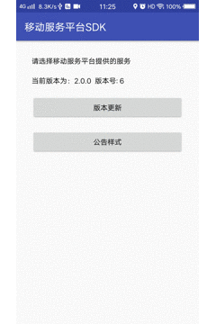

<h1 align="center">AppSp</h1>

一站式移动应用服务平台

### 介绍
我们专注做App公共服务，如常用的版本管理、公告管理、推送管理（进行中），在移动领域为中小公司以及个人赋能，减少重复造轮子的成本。AppSp完全开源，有详尽的开发和操作文档，我们将不遗余力，丰富AppSp功能，期待大家的使用并提出宝贵意见。

### 功能
* 前端采用Vue、Element UI。
* 后端采用Spring Boot、Spring Security、Redis、mybatis-plus。
* 权限认证使用Jwt，支持多终端认证系统。
* APP SDK 原生（iOS、Android） 采用java原生接口调用及系统信息收集
* Flutter SDK 基于APP SDK 基础进行封装，做到一套代码多端复用

### 在线体验
- admin/ajplus
1. 演示地址: [http://open-appsp.anji-plus.com](http://open-appsp.anji-plus.com)
2. 文档地址: [http://open-appsp.anji-plus.com/doc](http://open-appsp.anji-plus.com/doc)

### 演示图
#### 应用管理

#### 版本管理

#### 公告管理

#### 基础配置

#### 成员管理

#### app演示

#### 技术支持微信群

 #### 开源不易，劳烦各位star ☺

