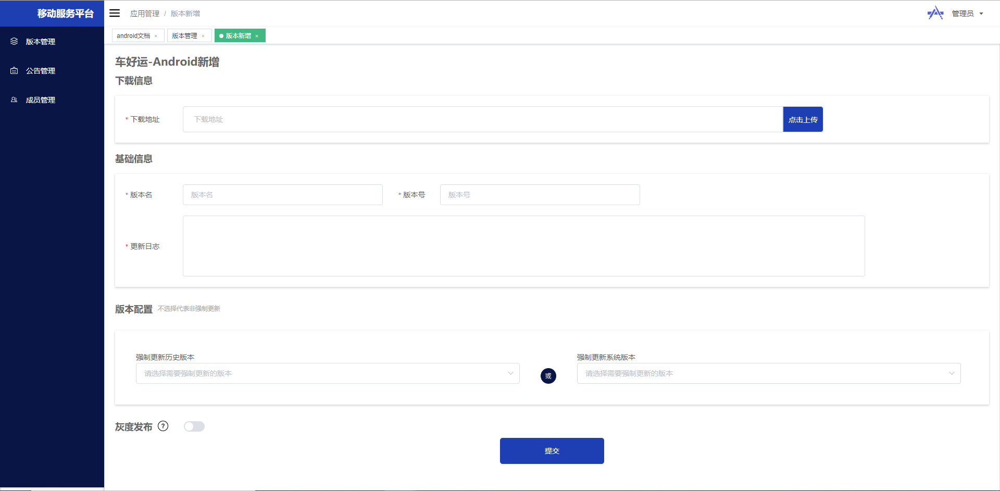
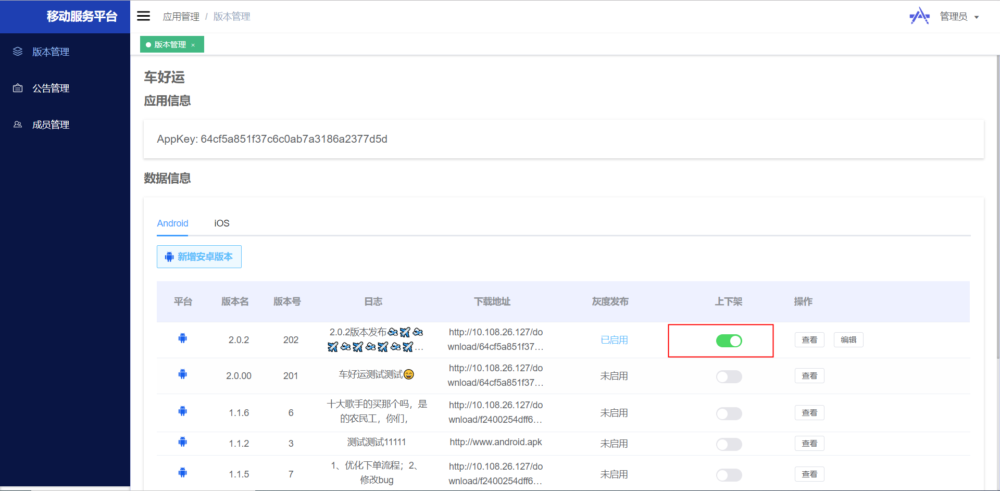
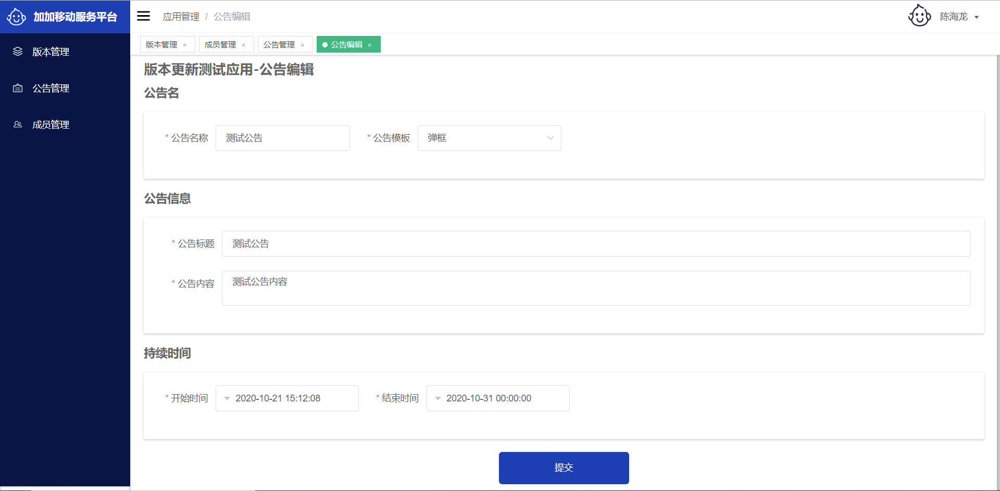
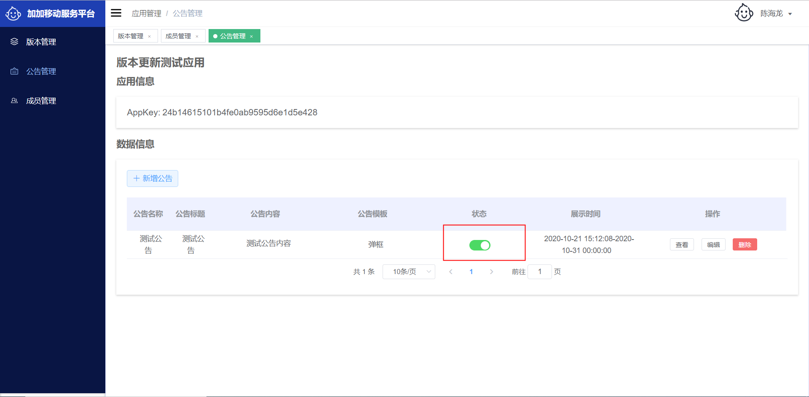
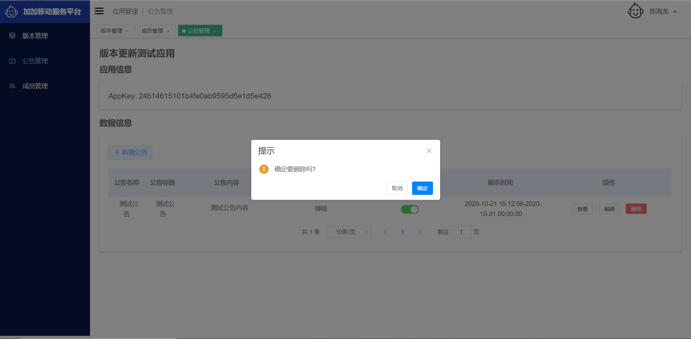

# 获取appKey
为了集成移动服务平台，您需要做如下操作：
```
1，提交工单，发送邮件至管理员，提供内容包括应用名、需添加账号、账号角色
2，管理员审核通过后，管理员将在移动服务平台创建应用，添加账号，并为账号分配角色
3，应用创建完毕，系统产生应用唯一appKey，该appKey是移动服务平台对移动端对接的唯一标识。
4，创建好的用户，此时可以登录服务平台进行操作，比如版本管理和公告管理
```

# 新增Android版本
登录后端管理系统，进入已创建好的`应用`，选择`版本管理`,点击`新增Android版本`,填写对应信息：
```
下载地址： 对应应用Android下载地址，包括apk下载地址或者外部跳转链接，用户可以在应用内下载apk或者跳转到应用外部浏览器进行下载apk
版本名： 应用对应的版本例如：1.0.1
版本号：对应应用编译的构建号，以数字递增形式，例如：1234
更新日志： 本次版本更新的内容
版本配置：1，历史版本选择强更：可选择历史的版本进行强制升级
         2，系统版本选择强更：对特定操作系统版本强制升级，例如Android8.2的操作系统需要更新，
            选择Android8即可对操作系统为Android8~Android9（不包括9）范围内容的机型进行强制更新
         注意：两者是“或”的关系，比如选择了1.0.1和Android8，表示只要是1.0.1的历史版本（不论是什么系统版本）都要强更，
              只要是Android8~Android9（不包括9）的版本都要强更
灰度发布：当用户量较大的时候，选择阶段发布可以保证稳定性，即七天内（可小于七天）设置发布率，平台会根据设置每天推送给一定量的用户，
          如果版本下架，灰度发布同步销毁
```
Android版本更新可以通过上传apk，将apk放到移动服务平台，这样可以集中式管理，上传apk之后，服务器将会把apk的信息及下载地址返回，可以直接使用对应apk信息，您也可以手动更改对应内容。
对应示例图如下：



配置完毕点击提交按钮，该版本默认是禁用状态，如果需要使用，在版本管理页打开上架开关，即可进行推送。
示例图如下：



# 编辑Android版本信息
当你需要修改对应Android版本信息，点击`编辑`,对该条版本信息进行编辑，只允许编辑版本名、版本号、更新日志。

# 集成
### host配置

```
针对Windows环境，C:\Windows\System32\drivers\etc 的host文件加入

199.232.4.133 raw.githubusercontent.com

针对Mac环境，在/etc/hosts下加入
```

### 项目/build.gradle下加入
```
// Top-level build file where you can add configuration options common to all sub-projects/modules.

buildscript {
    repositories {
        google()
        jcenter()
        //关键代码
        mavenCentral()
    }
    dependencies {
        classpath 'com.android.tools.build:gradle:3.4.1'

        // NOTE: Do not place your application dependencies here; they belong
        // in the individual module build.gradle files
    }
}

allprojects {
    repositories {
        google()
        jcenter()
        //关键代码
        maven { url "https://raw.githubusercontent.com/anji-plus/aj_android_appsp_aar/main" }
    }
}

task clean(type: Delete) {
    delete rootProject.buildDir
}


```

### 项目/app/build.gradle下添加依赖，比如要集成0.0.1
```

implementation 'anji.sdk.appsp:aar:0.0.1'

```

### 权限
```
    <!-- apk存储 -->
    <uses-permission android:name="android.permission.WRITE_EXTERNAL_STORAGE" />
    <!-- 网络请求 -->
    <uses-permission android:name="android.permission.INTERNET" />
    <uses-permission android:name="android.permission.ACCESS_WIFI_STATE" />
    <uses-permission android:name="android.permission.ACCESS_NETWORK_STATE" />
    <!-- apk升级 -->
    <uses-permission android:name="android.permission.REQUEST_INSTALL_PACKAGES" />
    <!-- 7.0+文件读取 com.anji.appsp.sdktest是Demo的包名-->
        <provider
            android:name="androidx.core.content.FileProvider"
            android:authorities="com.anji.appsp.sdktest.fileprovider"
            android:exported="false"
            android:grantUriPermissions="true">
            <meta-data
                android:name="android.support.FILE_PROVIDER_PATHS"
                android:resource="@xml/file_paths" />
        </provider>
```

### file_paths.xml代码
```
<?xml version="1.0" encoding="utf-8"?>
<paths>
    <external-path
        name="files_root"
        path="Android/data/com.anji.appsp.sdktest/" />
    <external-path
        name="external_storage_root"
        path="." />
    <root-path
        name="root_path"
        path="" />
</paths>
```

### Application中初始化
```
AppSpConfig.getInstance().init(this, appKey);

```

### 获取版本管理数据
```
    private void checkVersion(final UpdateType updateType) {
        AppSpConfig.getInstance().setVersionUpdateCallback(new IAppSpVersionUpdateCallback() {
            @Override
            public void update(AppSpModel<AppSpVersion> spModel) {
                //因为是异步，注意当前窗口是否活跃
                if (!isActive()) {
                    return;
                }
                //当前在子线程，注意
                versionUISuccess(updateType, spModel);
            }

            @Override
            public void error(String code, String msg) {
                versionUIError(code, msg);
            }
        });
    }

    private void versionUISuccess(final UpdateType updateType, final AppSpModel<AppSpVersion> spModel) {
        runOnUiThread(new Runnable() {
            @Override
            public void run() {
                AppSpVersion updateModel = spModel.getRepData();
                //注意判空
                if (updateModel == null) {
                    Toast.makeText(UpdateTestActivity.this, "当前为最新版本", Toast.LENGTH_LONG).show();
                    return;
                }
                String errorMsg = null;
                if (!AppSpRespCode.SUCCESS.equals(spModel.getRepCode())) {
                    errorMsg = spModel.getRepMsg();
                }

                if (errorMsg != null) {
                    Toast.makeText(UpdateTestActivity.this, errorMsg, Toast.LENGTH_LONG).show();
                } else {
                    //版本更新
                    handleUpdate(updateModel, updateType);
                }
            }
        });

    }

    private void versionUIError(String code, final String msg) {
        runOnUiThread(new Runnable() {
            @Override
            public void run() {
                if (msg != null) {
                    Toast.makeText(UpdateTestActivity.this, msg, Toast.LENGTH_LONG).show();
                }
            }
        });

    }
```

AppSpModel 数据格式：
```
//repCode: 业务返回码，0000表示成功
//repMsg: 业务日志
//repData: 返回数据，这里指向AppSpVersion

//AppSpVersion 数据格式为
//downloadUrl: 下载apk地址或者市场下载地址
//updateLog: 更新日志
//showUpdate: 是否允许弹出更新
//mustUpdate: 是否强制更新，true为强制更新

 {
 	"repCode": "0000",
 	"repMsg": "成功",
 	"repData": {
 		"downloadUrl": "http://10.108.26.128/download/674c0872fc4e4dd3be383b2dc3c37417bfa30158-fa83-475e-be57-fa350712af12.apk",
 		"mustUpdate": false,
 		"showUpdate": true,
 		"updateLog": "1，优化下单体验\n2，新增价格查询功能"
 	},
 	"success": true,
 	"error": false
 }

```
该接口移动端SDK已为这些操作处理好,只需要下载对应SDK接入appKey即可得到对应信息。

# 新增公告

后端返回一个公告列表，每条公告包含如下字段：
```
"templateType": "公告模板类型",
"templateTypeName": "公告模板名称",
"title": "公告标题",
"details": "公告内容",
```
输入需要显示的对应公告信息，公告模板分为`水平滚动`和`弹框`，可以选择自己需要的公告样式。
### 编辑公告
修改对应的公告信息。

### 启用公告
公告新增之后默认是禁用状态，如果需要启用的话，点击启用按钮进行启用

### 删除公告
如果您觉得该条信息有问题需要删除，点击删除即可。

`注意：谨慎操作删除功能，如果删除有误，将影响APP用户的使用。`
# 公告集成
### 1，Application中初始化
```
AppSpConfig.getInstance().init(this, appKey);

```
### 2，获取公告
```
 private void checkNotice(final NoticeEnum noticeType) {
        AppSpConfig.getInstance().setNoticeCallback(new IAppSpNoticeCallback() {
            @Override
            public void notice(AppSpModel<List<AppSpNoticeModelItem>> spModel) {
                //因为是异步，注意当前窗口是否活跃
                if (!isActive()) {
                    return;
                }
                //当前在子线程，注意
                noticeUISuccess(noticeType, spModel);
            }

            @Override
            public void error(String code, String msg) {
                noticeUIError(code, msg);
            }
        });

    }
```

### AAR 下载
若要参考具体集成流程，可下载我们提供的Demo，

Android AAR下载地址：
[https://github.com/anji-plus/aj_android_appsp_aar](https://github.com/anji-plus/aj_android_appsp_aar)

### Demo下载
若要参考具体集成流程，可下载我们提供的Demo，

Android Demo下载地址：
[https://github.com/anji-plus/aj_android_appsp](https://github.com/anji-plus/aj_android_appsp)

# 加入我们

如有集成问题，请加我们微信群交流：


