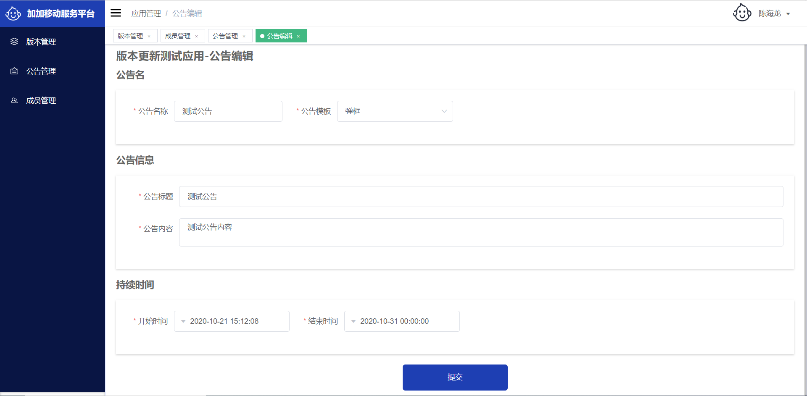
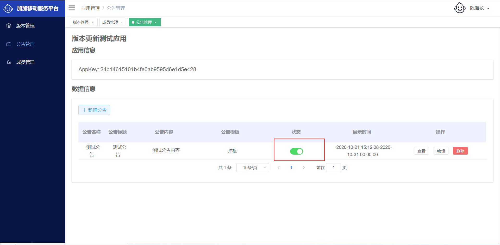
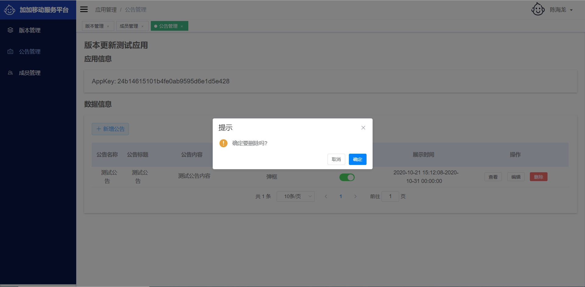

# 获取appKey
为了集成移动服务平台，您首先需要到移动服务平台官方网站申请注册并创建应用，获取应用的appKey，改appKey是移动服务平台对移动端使用的唯一标识。
# 新增iOS版本
登录后端管理系统，进入已创建好的`应用`，选择`版本管理`,点击`新增iOS版本`,填写对应信息：
```
下载地址： 对应应用App Store地址
版本名： 应用对应的版本例如：1.0.1
版本号 ：对应应用编译的构建号，以数字递增形式，例如：1234
更新日志： 本次版本更新的内容
版本配置：该功能使用于针对特定操作系统版本需要强制更新的版本，例如iOS 13.3的操作系统需要更新，选择iOS13即可对操作系统为iOS13范围内容的机型进行强制更新
```
对应示例图如下：


配置完毕点击提交按钮，该版本默认是禁用状态，如果需要使用，请打开启用按钮，即可进行推送。
示例图如下：


# 编辑iOS版本信息
当你需要修改对应iOS版本信息，点击`编辑`,对该条版本信息进行编辑，处理方式跟`新增iOS版本`类似。


# 删除iOS版本信息
如果您觉得该条信息有问题需要删除，点击删除即可。
`注意：谨慎操作删除功能，如果删除有误，将影响APP用户的使用。`

# 新增公告

后端返回一个公告列表，每条公告包含如下字段：
```
"templateType": "公告模板类型",
"templateTypeName": "公告模板名称",
"title": "公告标题",
"details": "公告内容",
```
输入需要显示的对应公告信息，公告模板分为`水平滚动`和`弹框`，可以选择自己需要的公告样式。
### 编辑公告
修改对应的公告信息。

### 启用公告
公告新增之后默认是禁用状态，如果需要启用的话，点击启用按钮进行启用

### 删除公告
如果您觉得该条信息有问题需要删除，点击删除即可。

`注意：谨慎操作删除功能，如果删除有误，将影响APP用户的使用。`

# iOS SDK集成
### 1.使用CocoaPods接入SDK
* 使用CocoaPods引入 **AJAppSpSdk** 先进入项目Podfile文件进行配置

```
platform :ios, '9.0'
use_frameworks!

target '<Your Target Name>' do
	# 示例：0.0.1，可以选择指定发布版本
    pod 'AJAppSpSdk', '~> 0.0.1'
end

```
* 然后打开终端，进入Podfile所在目录路径

```
$ pod install
```
* 支持版本说明

> * iOS 9.0+
> * Xcode 11+
> * Swift 5.0+

### 2.快速接入如下使用
**1、初始化服务**

```
import UIKit
//导入头文件
import AJAppSpSdk

class ViewController: UIViewController {

    override func viewDidLoad() {
        super.viewDidLoad()
        self.view.backgroundColor = UIColor.lightGray

        //初始化SDK服务
        initAJSDKConfigure()

    }

    //初始化SDK数据 (建议在项目启动以后 AppDelegate 中初始化)
    func initAJSDKConfigure() {
        let appKey = "移动管理平台获取自己的AppKey"
        AppSpService.shareService.setAppkey(appKey: appKey)
    }
}
```
**2、获取版本信息**

```
  /*
     获取 版本更新数据
     1、因为是异步，操作UI建议判断是否是主线程
     2、repInfo：服务器响应数据包（具体格式见下文）
     3、errorInfo：请求异常error信息（具体格式见下文）
     */
    func requestUpdateVersion() {
        AppSpService.shareService.checkVersionUpdate { (repInfo) in
            print(repInfo)
        } failure: { (errorInfo) in
            print(errorInfo)
        }
    }
```
**请求返回数据结构如下**
***
repInfo

```
 {
 	"repCode": "0000", //业务返回码，0000表示成功
 	"repMsg": "成功",  //业务日志
 	"repData": {
 		"downloadUrl": "app下载地址",
 		"mustUpdate": false, //是否强制更新，true为强制更新
 		"showUpdate": true, //是否允许弹出更新
 		"updateLog": "更新日志"
 	}
 }
```
***
errorInfo

```
repCode: 抛出异常Code
repMsg: 异常信息

```

**3、获取公告信息**

```
  /*
        获取 公告信息数据
     1、因为是异步，操作UI建议判断是否是主线程
     2、repInfo：服务器响应数据包（具体格式见下文）
     3、errorInfo：请求异常error信息（具体格式见下文）
     */
    func requestNoticeInfo() {
        AppSpService.shareService.getNoticeInfo { (repInfo) in
            print(repInfo)
        } failure: { (errorInfo) in
            print(errorInfo)
        }

    }
```
**请求返回数据结构如下**
***
repInfo

```
 {
 	"repCode": "0000", //业务返回码，0000表示成功
 	"repMsg": "成功", //业务日志
 	"repData": [ // 返回数据为 Array
 		{
	 		"title": "公告标题",
	 		"details": "公告内容",
	 		"templateType": "dialog", //公告类型（ 弹窗：dialog； 水平滚动：horizontal_scroll）
	 		"startTime": 1601186454000, //公告有效开始时间（毫秒级）
	 		"endTime": 1601359255000 //公告有效截止时间（毫秒级）
 		}
 	]
 }
```
***
errorInfo

```
repCode: 抛出异常Code
repMsg: 异常信息

```


# Demo下载
若要参考具体集成流程，可下载我们提供的Demo，

iOS SDK Demo下载地址：
[https://github.com/anji-plus/aj_ios_appsp](https://github.com/anji-plus/aj_ios_appsp)

# 加入我们

如有集成问题，请加我们微信群交流：


